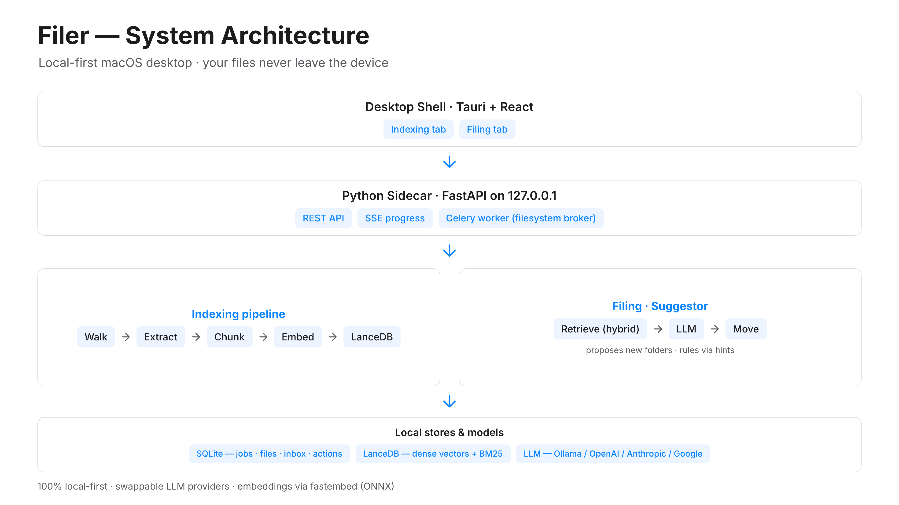

<!-- _paginate: false -->

# Filer

### Local-first, AI-assisted file filing for macOS

RAG-based folder suggestions · swappable LLMs · label-free evaluation

 

*<presenter> · <venue / date>*

---

<!-- Architecture: the exported Pencil diagram is the full slide. -->

---

## Experimental Methodology

**Leave-one-out, label-free** — a file's *real* folder is the ground truth, so no manual annotation.

1. **Index the library once** — extract → chunk → embed → LanceDB.
2. For each held-out file: query with its own content, but **exclude its own chunks** (`exclude_file_ids`) so it can't retrieve itself — **no per-sample reindex**.
3. Predict ranked destination folders; compare the top picks to the true folder.

**Metrics:** Top-1 · Top-3 · MRR · hierarchical path-prefix credit
**Buckets:** by file kind · by folder density (existing vs. singleton / new folder)
**Reproducible:** fixed seed ⇒ the *same* held-out set across experiments (e.g. `EXP_BASE` vs `EXP_OPENAI`)

---

## Experiment Results  *(placeholder)*

| Experiment | acc@1 | acc@3 | MRR | prefix |
|---|:--:|:--:|:--:|:--:|
| `EXP_BASE` — retrieval only | – | – | – | – |
| `EXP_OLLAMA` — llama3.1 | – | – | – | – |
| `EXP_OPENAI` — gpt-4o-mini | – | – | – | – |
| `EXP_ANTHROPIC` — claude | – | – | – | – |

*Populate from `evals/summary.csv` after a run:*
`uv run python -m filer_backend.eval run --label EXP_BASE`

- Per-bucket breakdown (file kind, folder density) goes here as a grouped bar chart.
- New-folder inference cases reported separately.
